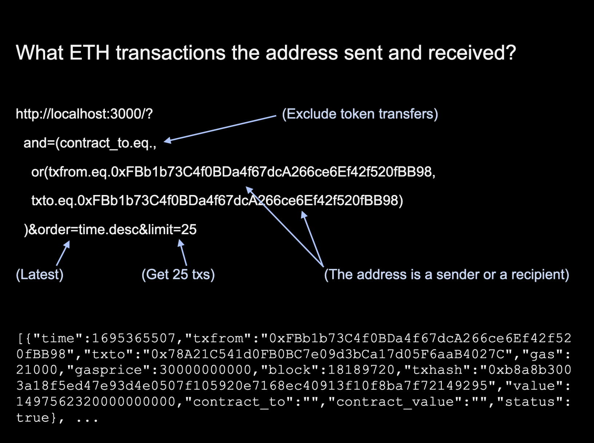

# Indexer for Ethereum to get transaction list by ETH address

Known Ethereum nodes lack the functionality to get a transaction list for an ETH address (account). This Indexer allows one to explore ETH and ERC20 transactions by Ethereum address and obtain a history of any user|wallet in just a move as Etherscan does.

Indexer is written in Python. It works as a service in the background:

- Connects to Ethereum node (works well with Geth, Nethermind, or other node, which provides http/ws/ipc API)
- Stores all transactions in the Postgres database
- Provides data for API to get transactions by address with postgrest

Sample request:



## Stored information

All indexed transactions include (database field names shown):

- `time` is a transaction's timestamp
- `txfrom` sender's Ethereum address
- `txto` recipient's Ethereum address
- `value` stores the amount of ETH transferred
- `gas` indicates `gasUsed`
- `gasprice` indicates `gasPrice`
- `block` is a transaction's block number
- `txhash` is a transaction's hash
- `contract_to` indicates the recipient's Ethereum address in case of a token transfer
- `contract_value` stores amount of ERC20 transaction in its tokens
- `status` tx status

To reduce storage requirements, Indexer stores only token transfer ERC20 transactions, started with `0xa9059cbb` in raw tx input.

An example:

```
{
  "time": 1576008898,
  "txfrom": "0x6B924750e56A674A2Ad01FBF09C7c9012f16f094",
  "txto": "0x1143E097e134F3407eF6B088672CCECE9A4f8CDD",
  "gas": 21000,
  "gasprice": 2500000000,
  "block": 9084957,
  "txhash": "0xcf56a031dfc89f5a3686cd441ea97ae96a66f5809a4c8c1b370485a04fb37e0e",
  "value": 1200000000000000,
  "contract_to": "",
  "contract_value": "",
  "status": true
}
```

Refers to transaction 0xcf56a031dfc89f5a3686cd441ea97ae96a66f5809a4c8c1b370485a04fb37e0e.

## Ethereum Indexer's API

To get Ethereum transactions by address, Postgrest is used. It provides RESTful API to the Postgres index database.

After an index is created, you can use requests like

```
curl -k -X GET "http://localhost:3000/?and=(contract_to.eq.,or(txfrom.eq.0xFBb1b73C4f0BDa4f67dcA266ce6Ef42f520fBB98,txto.eq.0xFBb1b73C4f0BDa4f67dcA266ce6Ef42f520fBB98))&order=time.desc&limit=25"
```

The request will show the 25 last transactions for Ethereum address 0xFBb1b73C4f0BDa4f67dcA266ce6Ef42f520fBB98 (Bittrex), ordered by timestamp. For API reference, see [Postgrest](https://postgrest.org/en/stable/api.html).

# Ethereum Indexer Setup

## Prerequisites

- Ethereum node with RPC API enabled: Geth, Nethermind, etc.
- Python 3
- Postgresql
- Postgrest for API
- nginx or other web server (in case of public API)

## Installation

### Ethereum Node

Make sure your Ethereum node is installed and fully synced. You can check its API and best block height with the command:

```
curl --data '{"method":"eth_blockNumber","params":[],"id":1,"jsonrpc":"2.0"}' -H "Content-Type: application/json" -X POST localhost:8545
```

### Python modules

Install Python 3. Install python modules:

```
apt install python3-pip
pip3 install web3
pip3 install psycopg2
```

### PostgreSQL

Install Postgres. Create Postgres user/role:

``` bash
su - postgres #switch to psql admin user
createuser -s api_user
```

Where `api_user` is a user who will run the indexer service. (As example, we create a superuser. You can use your own grants.)

Create database `index` for Ethereum transaction index:

``` sql
CREATE DATABASE index;
```

Add tables into `index` using SQL script `create_tables.sql`:

``` bash
psql -f create_tables.sql index
```

For case-insensitive comparisons, we use `citex` data type instead of `text`.

Create database indexes to request tx data fast. **It's better to allow this tool to store initial tx data until the current block first, and then create these indexes. Filling initial tx data will be faster this way.**

Create recommended database indexes:

``` bash
psql -f create_indexes.sql index
```

Create additional database indexes:

``` bash
psql -f create_indexes_add.sql index
```

Additional indexes cover more complex requests, such as getting Ethereum-only or specific token transactions for an address. [See Request examples](#api-request-examples).

Remember to grant privileges to psql database `index` and tables for users you need. Example:

``` sql
\c index
GRANT ALL ON ethtxs TO api_user;
GRANT ALL ON aval TO api_user;
GRANT ALL ON max_block TO api_user;
GRANT ALL PRIVILEGES ON DATABASE index TO api_user;
GRANT ALL PRIVILEGES ON ALL TABLES IN SCHEMA public TO api_user;
```

### Ethereum transaction Indexer

`ethsync.py` is a script that makes an Ethereum transaction index. It accepts the following env variables:

- DB_NAME: Postgres database name. Example: `index`.
- ETH_URL: Ethereum node url to reach the node. Supports websocket, http and ipc. See examples in `ethsync.py`.
- START_BLOCK: the first block to synchronize from. Default is 1.
- CONFIRMATIONS_BLOCK: the number of blocks to leave out of the synch from the end. I.e., last block is current `blockNumber - CONFIRMATIONS_BLOCK`. Default is 0.
- PERIOD: Number of seconds between synchronization. Default is 20 sec.
- LOG_FILE: optional file path and name where s=to save logs. If not provided, use StreamHandler.

The indexer can fetch transactions not from the beginning, but from a particular block number `START_BLOCK`. It will speed up the indexing process and reduce database size. For a reference:

- index size starting from 5,555,555 block to 9,000,000 (3.5 mln blocks) is about 190 GB
- index size starting from 11,000,000 block to 12,230,000 (1 mln blocks) is about 83 GB
- index size starting from 14,600,000 block to 15,100,000 (0.5 mln blocks) is about 27 GB
- index size starting from 14,600,000 block to 18,100,000 (3.5 mln blocks) with additional indexes is about 289 GB

At first start, the Indexer will store transactions starting from the block you set. It will take time. After that, it will check for new blocks every `PERIOD` seconds and update the index.

Sample run string:

```
DB_NAME=index ETH_URL=http://127.0.0.1:8545 START_BLOCK=14600000 LOG_FILE=/home/api_user/ETH-transactions-storage/ethsync.log python3 /home/api_user/ETH-transactions-storage/ethsync.py
```

We recommend running the Indexer script `ethsync.py` as a background service to ensure it will be restarted in case of failure. See `ethsync.service` as an example. Copy it to /lib/systemd/system/ethsync.service, update according to your settings, then register a service:

```
systemctl start ethsync.service
systemctl enable ethsync.service
```

Note, that indexing takes time. To check the indexing process, get the last indexed block:

```
psql -d index -c 'SELECT MAX(block) FROM ethtxs;'
```

And compare it to the Ethereum node's best block.

### Troubleshooting

To test the connection from the script, set a connection line in `ethtest.py`, and run it. In case of success, it will print the current Ethereum's last block.

To test a connection to a Postgres database `index`, run `pgtest.py`.

### Transaction API with Postgrest

[Install and configure](https://postgrest.org/en/stable/install.html) Postgrest.
Here is an example of running API for user `api_user` connected to `index` database on the 3000 port:

```
db-uri = "postgres://api_user@/index"
db-schema = "public"
db-anon-role = "api_user"
db-pool = 10
server-host = "127.0.0.1"
server-port = 3000
```

Make sure you add Postgrest in crontab for autostart on reboot:

```
@reboot cd /usr/share && /usr/bin/postgrest ./postgrest.conf
```
  
### Make Indexer's API public

If you need to provide public API, use any web server like nginx and set a proxy to Postgrest port in config:

```
location /ethtxs {
    proxy_pass http://127.0.0.1:3000;
}
location /aval {
    proxy_pass http://127.0.0.1:3000;
}
location /max_block {
    proxy_pass http://127.0.0.1:3000;
}

```

This way, endpoints will be available:

- `/ethtxs` used to fetch Ethereum transactions by address
- `/aval` returns the status of service. Endpoint `aval` is a table with `status` field just to check API availability.
- `/max_block` returns max Ethereum-indexed block

Example:

```
https://yourdomain.com/max_block
```

## Dockerized and docker-compose

by Guénolé de Cadoudal (guenoledc@yahoo.fr)

In the `docker-compose.yml`, you find a configuration that shows how this tool can be embedded in a docker configuration with the following processes:

- postgres db: to store the indexed data
- postgREST tool to expose the data as a REST api (see above comments)
- GETH node in POA mode. It can be Nethermind or another node, but it has not been tested
- EthSync tool (this tool)

[Set env variables](#ethereum-transaction-indexer).

# API request examples

Get the last 25 Ethereum transactions without ERC-20 transactions for address 0xFBb1b73C4f0BDa4f67dcA266ce6Ef42f520fBB98:

```
curl -k -X GET "http://localhost:3000/ethtxs?and=(contract_to.eq.,or(txfrom.eq.0xFBb1b73C4f0BDa4f67dcA266ce6Ef42f520fBB98,txto.eq.0xFBb1b73C4f0BDa4f67dcA266ce6Ef42f520fBB98))&order=time.desc&limit=25"

```

Get the last 25 USDT transactions for address 0xabfDF505fFd5587D9E7707dFB47F45AF1f03E275:

```
curl -k -X GET "http://localhost:3000/ethtxs?and=(txto.eq.0xdac17f958d2ee523a2206206994597c13d831ec7,or(txfrom.eq.0xabfDF505fFd5587D9E7707dFB47F45AF1f03E275,contract_to.eq.000000000000000000000000abfDF505fFd5587D9E7707dFB47F45AF1f03E275))&order=time.desc&limit=25"

```

Get the last 25 ERC-20 transactions without Ethereum transactions for address 0xFBb1b73C4f0BDa4f67dcA266ce6Ef42f520fBB98:

```
curl -k -X GET "http://localhost:3000/ethtxs?and=(contract_to.neq.,or(txfrom.eq.0xFBb1b73C4f0BDa4f67dcA266ce6Ef42f520fBB98,txto.eq.0xFBb1b73C4f0BDa4f67dcA266ce6Ef42f520fBB98))&order=time.desc&limit=25"

```

Get last 25 transactions for both ERC-20 and Ethereum for address 0xFBb1b73C4f0BDa4f67dcA266ce6Ef42f520fBB98:

```
curl -k -X GET "http://localhost:3000/ethtxs?and=(or(txfrom.eq.0xFBb1b73C4f0BDa4f67dcA266ce6Ef42f520fBB98,txto.eq.0xFBb1b73C4f0BDa4f67dcA266ce6Ef42f520fBB98))&order=time.desc&limit=25"

```

# License

Copyright © 2020-2022 ADAMANT Foundation
Copyright © 2017-2020 ADAMANT TECH LABS LP

This program is free software: you can redistribute it and/or modify it under the terms of the GNU General Public License as published by the Free Software Foundation, either version 3 of the License, or (at your option) any later version.
This program is distributed in the hope that it will be useful, but WITHOUT ANY WARRANTY; without even the implied warranty of MERCHANTABILITY or FITNESS FOR A PARTICULAR PURPOSE. See the GNU General Public License for more details.
You should have received a copy of the GNU General Public License along with this program. If not, see http://www.gnu.org/licenses/.
