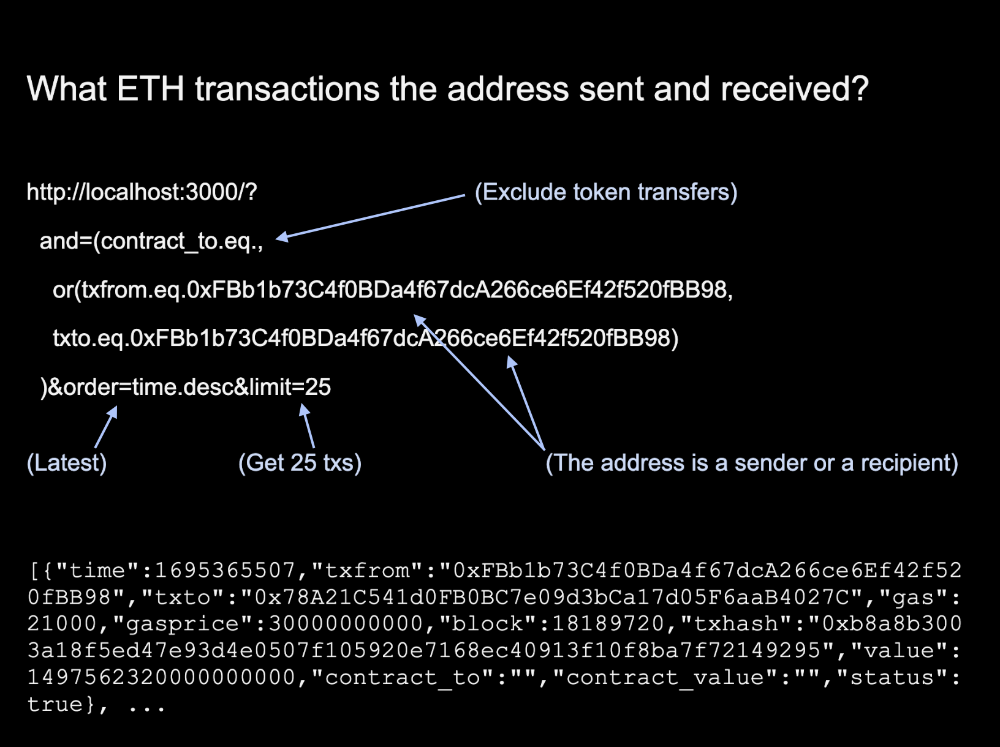

# Ethereum Transactions Storage

Ethereum nodes lack built-in functionality to query transaction history by an Ethereum address. `ETH-transactions-storage` is a background indexing service that tracks native ETH transfers and ERC-20 token transfers, stores them in PostgreSQL, and exposes a high-performance RESTful API via PostgREST for client apps (e.g., cryptocurrency wallets).

The indexer operates as a background service:

- Connects to an Ethereum node via HTTP, WebSocket, or IPC (compatible with Geth, Nethermind, Besu, and Erigon)
- Indexes native ETH transfers and ERC-20 token transfers into a PostgreSQL database
- Optionally stores only transfers related to a configured list of Ethereum addresses
- Serves transaction history by address using PostgREST

Sample request:



## Stored Information

All indexed transactions contain the following database fields:

- `time`: Transaction block timestamp (Unix epoch seconds)
- `txfrom`: Sender's Ethereum address (`citext`, case-insensitive)
- `txto`: Recipient's Ethereum address or contract address (`citext`, case-insensitive)
- `value`: Amount of ETH transferred in wei (`numeric`)
- `gas`: Gas used by the transaction (`gasUsed`, `bigint`)
- `gasprice`: Gas price in wei (`gasPrice`, `bigint`)
- `block`: Block number (`integer`)
- `txhash`: Transaction hash (`citext`, case-insensitive)
- `contract_to`: Recipient address for ERC-20 token transfers (`citext`, case-insensitive)
- `contract_value`: Token transfer amount in raw token units (`citext`)

To minimize storage overhead, the indexer stores native ETH transfers and ERC-20 token transfer transactions matching the `0xa9059cbb` method signature (`transfer(address,uint256)`).

The internal `sync_state` table stores the last processed block independently from transaction rows. This keeps synchronization progress accurate when a block is empty or when the optional address filter excludes every transaction in a block.

Example JSON record from `/ethtxs`:

```json
{
  "time": 1576008898,
  "txfrom": "0x6B924750e56A674A2Ad01FBF09C7c9012f16f094",
  "txto": "0x1143E097e134F3407eF6B088672CCECE9A4f8CDD",
  "value": 1200000000000000,
  "gas": 21000,
  "gasprice": 2500000000,
  "block": 9084957,
  "txhash": "0xcf56a031dfc89f5a3686cd441ea97ae96a66f5809a4c8c1b370485a04fb37e0e",
  "contract_to": "",
  "contract_value": ""
}
```

## Ethereum Indexer API

PostgREST provides a RESTful HTTP interface on top of the PostgreSQL database.

After setup, clients can query transactions using standard PostgREST syntax:

```bash
curl -s "http://127.0.0.1:3000/ethtxs?and=(contract_to.eq.,or(txfrom.eq.0xFBb1b73C4f0BDa4f67dcA266ce6Ef42f520fBB98,txto.eq.0xFBb1b73C4f0BDa4f67dcA266ce6Ef42f520fBB98))&order=time.desc&limit=25"
```

This request retrieves the 25 most recent native ETH transactions for address `0xFBb1b73C4f0BDa4f67dcA266ce6Ef42f520fBB98`, ordered by timestamp descending. For full query syntax, see the [PostgREST API reference](https://postgrest.org/en/stable/api.html).

Available endpoints:

- `/ethtxs`: Query indexed Ethereum and ERC-20 transactions
- `/max_block`: Returns the highest indexed block number and indexer version (used for client health checks)
- `/aval`: Service availability check endpoint

## Setup Instructions

## Prerequisites

- Synchronized Ethereum node with RPC API enabled (Geth, Nethermind, Besu, Erigon)
- Python 3.9+
- PostgreSQL 12+
- PostgREST 10+
- Reverse proxy (e.g., nginx) for public deployments

## Installation

### 1. Ethereum Node

Ensure your Ethereum node is installed, running, and synchronized. Verify RPC connectivity and block height:

```bash
curl -H "Content-Type: application/json" \
  -X POST --data '{"jsonrpc":"2.0","method":"eth_blockNumber","params":[],"id":1}' \
  http://127.0.0.1:8545
```

### 2. Python Dependencies

Install required Python modules:

```bash
pip3 install -r requirements.txt
```

### 3. PostgreSQL Database & User Setup

Create the database user and the `index` database. **`api_user` does not need superuser privileges:**

```bash
# Switch to postgres system user
sudo su - postgres

# Create the indexer role without superuser privileges
createuser api_user

# Create the index database
createdb -O api_user index
```

Apply table schemas, views, and read-only roles using `create_tables.sql`:

```bash
psql -d index -f create_tables.sql
```

Grant explicit minimal table permissions to `api_user`:

```sql
\c index
GRANT SELECT, INSERT, DELETE ON public.ethtxs TO api_user;
GRANT SELECT, INSERT, UPDATE ON public.sync_state TO api_user;
GRANT SELECT ON public.aval, public.max_block TO api_user;
```

Existing deployments must reapply `create_tables.sql` before starting this version. The idempotent script creates `sync_state`, initializes it from the existing highest transaction block, grants its DML permissions to existing `api_user` and `app_user` roles, and updates the `/max_block` view without deleting transaction data.

#### Production Upgrade Order

Use this order for an existing bare-metal or systemd deployment:

1. Stop the indexer so the database checkpoint and deployed code cannot diverge.
2. Update the checkout, including `ethsync.py`, `address_filter.py`, and `requirements.txt`.
3. Run `pip3 install -r requirements.txt` to install `python-dotenv` before starting the new code.
4. Run `psql -d index -f create_tables.sql` as a role allowed to update the schema and grants.
5. Verify that the existing service environment still contains the production `DB_NAME`, `ETH_URL`, `START_BLOCK`, `CONFIRMATIONS_BLOCK`, `PERIOD`, and `LOG_FILE` values. The previous systemd unit can remain in place because process environment values override `.env` and the address filter defaults to disabled.
6. Start the indexer and verify that `/max_block` advances.

Do not replace an existing systemd unit with the repository template until a production `.env` containing equivalent values has been created. The repository `.env.example` uses safe standalone defaults, but every endpoint, credential, and starting block still requires operator review.

#### Read-Only Anonymous Role (`web_anon`)

To prevent unauthorized write operations through PostgREST, a dedicated read-only role `web_anon` is used for unauthenticated API requests.

`create_tables.sql` configures `web_anon` and its grants automatically and idempotently. For existing databases being upgraded without re-running `create_tables.sql`, apply the following migration:

```sql
\c index
DO $$
BEGIN
    IF NOT EXISTS (SELECT FROM pg_roles WHERE rolname = 'web_anon') THEN
        CREATE ROLE web_anon NOLOGIN;
    END IF;
    IF EXISTS (SELECT FROM pg_roles WHERE rolname = 'api_user') THEN
        GRANT web_anon TO api_user;
    END IF;
END
$$;

GRANT USAGE ON SCHEMA public TO web_anon;
GRANT SELECT ON public.ethtxs, public.aval, public.max_block TO web_anon;
```

> **Upgrade note for existing deployments:** Ensure `GRANT SELECT ON public.max_block TO web_anon;` is executed. Without this grant, the `/max_block` health check used by ADAMANT clients will fail with permission errors.

### 4. Database Indexes & Storage Planning

For fast querying, create database indexes.

**Recommendation:** Allow `ethsync.py` to index initial block history up to the current block _first_, then build indexes. Ingesting initial historical data without indexes is significantly faster.

#### Minimal Core Index Set (Recommended)

Audit of real ADAMANT client traffic (`adamant-im` and `adamant-iOS`) establishes a minimal 5-index set that covers all production client query shapes while saving **~90–110 GB** of disk space per 1-year dataset (~490M rows):

1. Apply core indexes:

```bash
psql -d index -f create_indexes.sql
```

This creates:

- `block_index` on `(block)` — `/max_block` health check
- `txfrom_index` on `(txfrom)` — Sender address queries
- `txto_contract_to_index` on `(txto, contract_to)` — ERC-20 / USDT recipient queries
- `txto_w_empty_contract_to_index` on `(txto) WHERE contract_to = ''` — Native ETH recipient queries

2. Apply timestamp ordering index:

```bash
psql -d index -f create_indexes_add.sql
```

This creates:

- `time_index` on `(time)` — Timestamp descending sorting (`order=time.desc`)

| Index Configuration                                                   | Total Index Size (~490M rows / 1 yr) |
| --------------------------------------------------------------------- | ------------------------------------ |
| Minimal 5-index set (`create_indexes.sql` + `create_indexes_add.sql`) | **~80–95 GB**                        |
| Full 8-index legacy set (`create_indexes_legacy.sql`)                 | **~265 GB**                          |

#### Legacy / Deprecated Indexes (`create_indexes_legacy.sql`)

If custom or third-party integrations require non-standard queries (e.g., querying `contract_to` without `txto` or unconditioned `txto`), optional legacy indexes can be created:

```bash
psql -d index -f create_indexes_legacy.sql
```

#### Reclaiming Disk Space on Existing Nodes

Upgrading an existing node by creating the new minimal index set does not automatically drop old indexes from disk. After applying `create_indexes.sql` and `create_indexes_add.sql`, existing operators can reclaim **~90–110 GB** of disk space by dropping redundant indexes concurrently without blocking ongoing writes:

```sql
DROP INDEX CONCURRENTLY IF EXISTS public.contract_to_index;
DROP INDEX CONCURRENTLY IF EXISTS public.txto_index;
DROP INDEX CONCURRENTLY IF EXISTS public.txto_txfrom_index;
```

#### Operational Note on Index Building

`CREATE INDEX` acquires a `ShareLock` on `ethtxs` which blocks write transactions from `ethsync.py`. For live production databases, schedule index creation during maintenance windows or execute using `CREATE INDEX CONCURRENTLY`.

### 5. Running the Indexer (`ethsync.py`)

`ethsync.py` synchronizes blocks from the Ethereum node into PostgreSQL.

#### Environment Variables

| Variable                 | Default                | Description                                                                   |
| ------------------------ | ---------------------- | ----------------------------------------------------------------------------- |
| `DB_NAME`                | _(required)_           | PostgreSQL database name (e.g., `index`) or connection URI                    |
| `ETH_URL`                | _(required)_           | Ethereum node RPC endpoint (`http://...`, `ws://...`, or `/path/to/geth.ipc`) |
| `START_BLOCK`            | `1`                    | Starting block height when indexing from an empty database                    |
| `CONFIRMATIONS_BLOCK`    | `0`                    | Number of confirmation blocks to lag behind the chain head                    |
| `PERIOD`                 | `20`                   | Polling interval in seconds between synchronization passes                    |
| `LOG_FILE`               | `None`                 | File path for logging (if omitted, logs to stdout stream)                     |
| `ADDRESS_FILTER_ENABLED` | `false`                | Enables the monitored-address filter                                          |
| `ADDRESS_FILTER_FILE`    | `filter/addresses.txt` | Path to the monitored-address list                                            |

Copy the documented environment template before the first run:

```bash
cp .env.example .env
chmod 600 .env
```

The local `.env` contains standalone indexer settings and Docker Compose service settings and is intentionally ignored by Git. `ethsync.py`, `ethtest.py`, and `pgtest.py` load this file automatically. Values already present in the process environment take precedence, so standalone runs can override individual settings without editing `.env`. Docker Compose constructs its internal PostgreSQL URIs from `POSTGRES_DB`, `POSTGRES_USER`, and `POSTGRES_PASSWORD`, leaving the password in one configuration field.

Use only URL-safe letters, digits, periods, underscores, tildes, and hyphens for `POSTGRES_PASSWORD`. Avoid `$`, which Docker Compose treats as interpolation, and URI delimiter characters such as `:`, `/`, and `@`.

```bash
DB_NAME=index \
ETH_URL=http://127.0.0.1:8545 \
PERIOD=20 \
python3 ethsync.py
```

#### Address Filter

The address filter reduces database storage by retaining only native ETH and ERC-20 transfers related to monitored addresses. The live list is private and ignored by Git and Docker image builds. To enable it:

1. Run `cp filter/addresses.txt.example filter/addresses.txt` and `chmod 600 filter/addresses.txt`.
2. Add one `0x`-prefixed, 40-hex-character Ethereum address per line. Empty lines, full-line comments, and text after `#` are ignored.
3. Set `ADDRESS_FILTER_ENABLED=true` in `.env` or in the process environment.
4. Start or restart the indexer.

Matching is case-insensitive. Native transfers match `txfrom` or `txto`; ERC-20 transfers also match the token contract in `txto` and the ABI-encoded recipient stored in `contract_to`. For the supported `transfer(address,uint256)` call, the token sender is the transaction's `txfrom` value.

The indexer does not store internal ETH transfers or ERC-20 transfers that are not direct `transfer(address,uint256)` calls, including `transferFrom`, multisig, router, batch, and aggregator flows. These are existing indexer limitations and remain outside the filter's visibility.

The list is reloaded before every synchronization pass, so valid additions and removals take effect without a restart. An enabled filter fails closed: a missing, empty, or invalid file prevents further block processing until the configuration is corrected.

The filter affects only newly processed blocks. Enabling it does not remove existing rows, and adding an address does not automatically backfill its earlier history.

To rebuild all filtered history, stop the indexer, set `START_BLOCK` to the intended first block, and reset both transaction data and the checkpoint:

```sql
BEGIN;
TRUNCATE TABLE public.ethtxs;
TRUNCATE TABLE public.sync_state;
COMMIT;
```

Truncating only `ethtxs` does not trigger a rebuild because `sync_state` still records the processed chain height. For a partial rescan from block `N`, delete transaction rows at or above `N` and set the singleton checkpoint to `N - 1` in the same database transaction before restarting.

#### Starting from a Specific Block Height

To accelerate synchronization and save storage, configure `START_BLOCK` to index from a recent block rather than genesis. Reference dataset sizes:

- Blocks 5,555,555 to 9,000,000 (3.5M blocks): ~190 GB
- Blocks 11,000,000 to 12,230,000 (1M blocks): ~83 GB
- Blocks 14,600,000 to 15,100,000 (0.5M blocks): ~27 GB
- Blocks 14,600,000 to 18,100,000 (3.5M blocks with all indexes): ~289 GB

Sample CLI execution:

```bash
DB_NAME=index \
ETH_URL=http://127.0.0.1:8545 \
START_BLOCK=14600000 \
LOG_FILE=/home/api_user/ETH-transactions-storage/ethsync.log \
python3 /home/api_user/ETH-transactions-storage/ethsync.py
```

#### Systemd Background Service

Run `ethsync.py` as a systemd service for automatic restarts on failure.

For a new installation, create and secure the required environment file first:

```bash
cp .env.example .env
chmod 600 .env
```

Replace the example values with production endpoints, credentials, block settings, and log paths. The systemd template intentionally requires this file so a missing production configuration fails before the indexer starts.

1. Copy the service file:

```bash
sudo cp ethsync.service /etc/systemd/system/ethsync.service
```

2. Update `WorkingDirectory`, `ExecStart`, and `EnvironmentFile` paths in `/etc/systemd/system/ethsync.service` when needed.

3. Enable and start the service:

```bash
sudo systemctl daemon-reload
sudo systemctl enable ethsync.service
sudo systemctl start ethsync.service
```

Check indexing progress by comparing the highest indexed block with the node's block height:

```bash
psql -d index -c 'SELECT MAX(block) FROM public.ethtxs;'
```

### 6. Troubleshooting & Diagnostics

- **Ethereum RPC connectivity:** Run `ethtest.py` to verify node connectivity and fetch current block height:

```bash
ETH_URL=http://127.0.0.1:8545 python3 ethtest.py
```

- **PostgreSQL connectivity:** Run `pgtest.py` to test database credentials and inspect current indexed block height:

```bash
DB_NAME=index python3 pgtest.py
```

### 7. PostgREST API Setup & Hardening

[Install PostgREST](https://postgrest.org/en/stable/install.html) and create `postgrest.conf`:

```ini
db-uri = "postgres://api_user@/index"
db-schema = "public"
db-anon-role = "web_anon"
db-pool = 10
db-max-rows = 10000
server-host = "127.0.0.1"
server-port = 3000
```

#### Important Security and Resource Guards

1. **`db-anon-role = "web_anon"`**: Ensures anonymous HTTP requests operate with read-only `SELECT` privileges.
2. **`db-max-rows = 10000`**: Caps the maximum rows returned per request. Without this, an unbounded request (`GET /ethtxs`) attempts to serialize the entire database table into a single JSON response, exceeding PostgreSQL's 1 GB memory buffer and causing out-of-memory errors (500).
   - An explicit `?limit=25` takes precedence and returns 25 rows
   - Requests exceeding `db-max-rows` or omitting `limit` are capped at 10,000 rows
   - **Note:** `db-max-rows` bounds rows _returned_, not rows _scanned_

#### Cutover Order for Upgrading Existing Nodes

When updating an existing production deployment to use `web_anon`, follow this exact sequence to prevent public API outages:

1. Apply the database permissions and create the `web_anon` role (via `create_tables.sql` or the SQL snippet in Section 3).
2. Verify that `web_anon` permissions are active:

```bash
psql -d index -c "SET ROLE web_anon; SELECT 1 FROM public.ethtxs LIMIT 1; SELECT * FROM public.max_block; SELECT * FROM public.aval;"
```

3. Update `postgrest.conf` (`db-anon-role = "web_anon"` and `db-max-rows = 10000`), then restart PostgREST.

> **Warning:** If `db-anon-role` is switched in `postgrest.conf` before PostgreSQL role grants take effect, PostgREST will fail to set the anonymous role and all public API requests will immediately return 500 errors.

Start PostgREST:

```bash
postgrest postgrest.conf
```

### 8. Public API & Reverse Proxy Hardening (nginx)

When exposing the indexer API publicly, configure nginx with security and performance guards:

```nginx
# Public ETH Indexer API proxy
location /ethtxs {
    # 1. Reject HTTP write verbs (API is read-only)
    if ($request_method !~ ^(GET|HEAD|OPTIONS)$) { return 405; }

    # 2. Require an address filter (txfrom or txto) to prevent catastrophic full table scans.
    # Unindexed queries (e.g., bare /ethtxs or filtering by txhash/gas/value) scan ~270+ GB of disk.
    if ($args !~ "(txfrom|txto)") { return 400; }

    # 3. Reject exact count aggregate headers that force full index scans
    if ($http_prefer ~* "count=") { return 400; }

    # 4. Reject unreasonable offset values
    if ($args ~ "offset=[0-9]{7,}") { return 400; }

    proxy_pass http://127.0.0.1:3000;
}

location /aval {
    if ($request_method !~ ^(GET|HEAD|OPTIONS)$) { return 405; }
    proxy_pass http://127.0.0.1:3000;
}

location /max_block {
    if ($request_method !~ ^(GET|HEAD|OPTIONS)$) { return 405; }
    proxy_pass http://127.0.0.1:3000;
}
```

> **Note on `txhash` queries:** `txhash` is not indexed in the minimal index set. To query transaction details by hash, use the Ethereum node JSON-RPC endpoint (`eth_getTransactionByHash`). Querying `/ethtxs?txhash=eq.<hash>` requires a full table scan and is intentionally blocked at the proxy level on public deployments.
>
> **Note on `server` block scope:** Place the method allow-list inside specific `location` blocks (`/ethtxs`, `/aval`, `/max_block`), not at the `server` level if root (`location /`) proxies to Ethereum JSON-RPC (which requires `POST`).

## Docker & Docker Compose

A complete multi-container setup is available in `docker-compose.yml`:

- `db`: PostgreSQL 14 with `create_tables.sql` auto-initialization
- `postgrest`: PostgREST configured with `web_anon` role and `PGRST_DB_MAX_ROWS=10000`
- `publicnode`: Local Geth node in dev mode (for testing)
- `eth-storage`: Python indexer service

Docker Compose reads the local `.env` file and mounts the repository `filter` directory read-only into the indexer container. Keep `ADDRESS_FILTER_FILE` inside that directory when using Compose. Review the example credentials and all endpoint values before using the stack outside local development.

Prepare local configuration before the first start:

```bash
cp .env.example .env
chmod 600 .env
cp filter/addresses.txt.example filter/addresses.txt
chmod 600 filter/addresses.txt
```

Compose mounts the `filter` directory rather than one file, so atomic-save editors that replace `filter/addresses.txt` remain visible to the running container during the next synchronization pass.

PostgreSQL executes `/docker-entrypoint-initdb.d/create_tables.sql` only when its data directory is empty. Before starting the new indexer against an existing Compose volume, apply the schema explicitly:

```bash
docker compose exec -T db sh -c \
  'psql --username "$POSTGRES_USER" --dbname "$POSTGRES_DB"' \
  < create_tables.sql
```

Start the containers:

```bash
docker compose up -d --build
```

## API Request Examples

### 1. Native ETH Transactions (PWA / `adamant-im` format)

Fetch the last 25 native ETH transactions for address `0xFBb1b73C4f0BDa4f67dcA266ce6Ef42f520fBB98`:

```bash
curl -s "http://127.0.0.1:3000/ethtxs?and=(contract_to.eq.,or(txfrom.eq.0xFBb1b73C4f0BDa4f67dcA266ce6Ef42f520fBB98,txto.eq.0xFBb1b73C4f0BDa4f67dcA266ce6Ef42f520fBB98))&order=time.desc&limit=25"
```

### 2. Native ETH Transactions (iOS / `adamant-iOS` format)

`adamant-iOS` executes two separate queries for incoming and outgoing transactions and merges them client-side:

```bash
# Outgoing transfers
curl -s "http://127.0.0.1:3000/ethtxs?txfrom=eq.0xFBb1b73C4f0BDa4f67dcA266ce6Ef42f520fBB98&contract_to=eq.&order=time.desc&limit=25"

# Incoming transfers
curl -s "http://127.0.0.1:3000/ethtxs?txto=eq.0xFBb1b73C4f0BDa4f67dcA266ce6Ef42f520fBB98&contract_to=eq.&order=time.desc&limit=25"
```

### 3. ERC-20 / USDT Transactions

Fetch the last 25 USDT transfers for address `0xabfDF505fFd5587D9E7707dFB47F45AF1f03E275` on USDT contract `0xdac17f958d2ee523a2206206994597c13d831ec7`:

```bash
curl -s "http://127.0.0.1:3000/ethtxs?and=(txto.eq.0xdac17f958d2ee523a2206206994597c13d831ec7,or(txfrom.eq.0xabfDF505fFd5587D9E7707dFB47F45AF1f03E275,contract_to.eq.000000000000000000000000abfDF505fFd5587D9E7707dFB47F45AF1f03E275))&order=time.desc&limit=25"
```

### 4. Service Status & Health Checks

Check the highest indexed block height and version:

```bash
curl -s "http://127.0.0.1:3000/max_block"
```

Response:

```json
[
  {
    "max": 19500000,
    "version": "2.5.0"
  }
]
```

Check API availability:

```bash
curl -s "http://127.0.0.1:3000/aval"
```

Response:

```json
[
  {
    "status": true
  }
]
```

## License

Copyright © 2025–2026 ADAMANT developer community  
Copyright © 2020–2024 ADAMANT Foundation  
Copyright © 2017–2020 ADAMANT TECH LABS LP

This program is free software: you can redistribute it and/or modify it under the terms of the GNU General Public License as published by the Free Software Foundation, either version 3 of the License, or (at your option) any later version.

This program is distributed in the hope that it will be useful, but WITHOUT ANY WARRANTY; without even the implied warranty of MERCHANTABILITY or FITNESS FOR A PARTICULAR PURPOSE. See the GNU General Public License for more details.

You should have received a copy of the GNU General Public License along with this program. If not, see <https://www.gnu.org/licenses/>.
